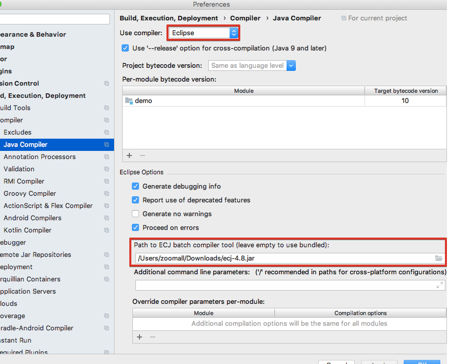

https://youtrack.jetbrains.com/issue/IDEA-198981

[Yaroslav Bedrov: Looks like compiler bug](https://youtrack.jetbrains.com/issue/IDEA-198981#focus=streamItem-27-3068522-0-0)

The solution is to use the Eclipse compiler.
But it may be that the Eclipse compiler that comes with IntelliJ [will be deprecated](https://youtrack.jetbrains.com/issue/IDEA-198981#focus=streamItem-27-3068639-0-0).
In this case, we must act as follows:

> Here is the link:  
> http://download.eclipse.org/eclipse/downloads/  
> After choosing the release you are brought to the page where various components are listed.  
> Search for "JDT Core Batch Compiler " in the page and download the corresponding jar.  
> In IDEA java compiler settings specify the path to the downloaded jar  

